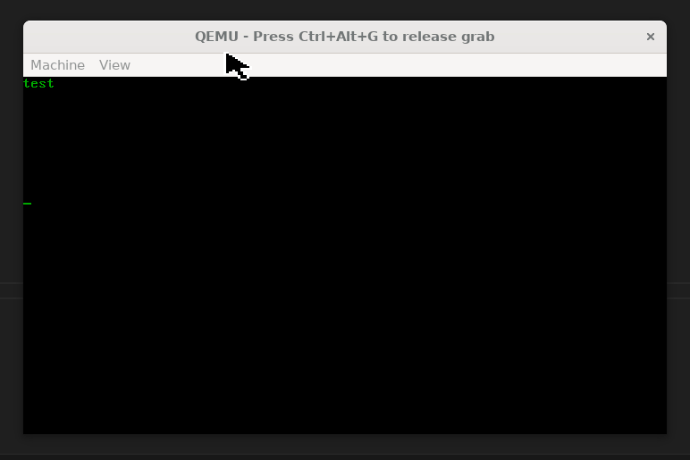

# Simple OS

### Projet de création d'un programme assembleur x86_64 capable de se lancer au démarrage de l'ordinateur

---------------

Ce projet à pour but de m'initier et de commencer la programmation sans système d'exploitation

# Etat des choses

- /hello_bootloader: Affiche un texte à l'écran

- /kernel_C : mon premier kernel en C

# Objectifs à venir

- [x] Mon défis suivant, serait d'afficher une chaine de caractère et donc une phrase.

- [ ] ~~Un autre serait de charger mon programme [nad_on_boot](https://github.com/nadnone/nad_on_boot) écrit en Rust à l'aide de ce bootloader~~
- [ ] ~~Je verrais ensuite (peut-être) comment jouer avec les autres composants de l'ordinateur en créant un ~~système d'exploitation~~ petit jeu simple~~

- [ ] Charger un kernel fait en C
    - [x] Charger et executer le kernel
    - [x] Récupérer les entrées clavier
    - [x] Créer un malloc() et un free() basique
    - [x] function timestamp() et sleep()
    - [ ] ...
    - [ ] transformer le kernel en un truc cool, comme un jeu simple

- [ ] Charger le kernel avec un bootloader (on croise les doigts)

## Afin de réussir ce projet, je me suis documenté avec les sources suivantes:

- Compréhension et initiation à l'assembleur x86 
    - https://en.wikibooks.org/wiki/X86_Assembly
- Comprendre le VGA texte mode
    - https://en.wikipedia.org/wiki/VGA_text_mode
- Comprendre ce qu'est l'interruption 0x10
    - https://en.wikipedia.org/wiki/INT_10H
- Liste des couleurs BIOS de base
    - https://en.wikipedia.org/wiki/BIOS_color_attributes
- Comprendre et faire un bootloader 
    - https://interrupt.memfault.com/blog/how-to-write-a-bootloader-from-scratch
- La commande TIMES en assembleur (NASM) 
    - https://softwareengineering.stackexchange.com/questions/165025/what-is-the-difference-between-times-and-dup-in-assembly-language
- Liste des fonctions de l'interruptions
    - https://www.gladir.com/LEXIQUE/INTR/INT10.HTM
    - https://wiki.osdev.org/BIOS
- Adresse de départ pour le registre es:bl 
    - https://stackoverflow.com/questions/34121971/using-es-register-gives-errors
- Registre bl interruption 0x10 function 0x13 
    - https://stackoverflow.com/questions/12556973/how-does-int-10-13h-work-with-attributes
- Manuel de genisoimage
    - https://manpages.debian.org/bullseye/genisoimage/genisoimage.1.en.html
- Cette playlist
    - https://www.youtube.com/watch?v=MwPjvJ9ulSc&list=PLm3B56ql_akNcvH8vvJRYOc7TbYhRs19M
- Créer un simple kernel en C et asm
    - https://github.com/chipsetx/Simple-Kernel-in-C-and-Assembly
- Fonctionnement du controlleur PS/2 sur x86
    - https://wiki.osdev.org/%228042%22_PS/2_Controller